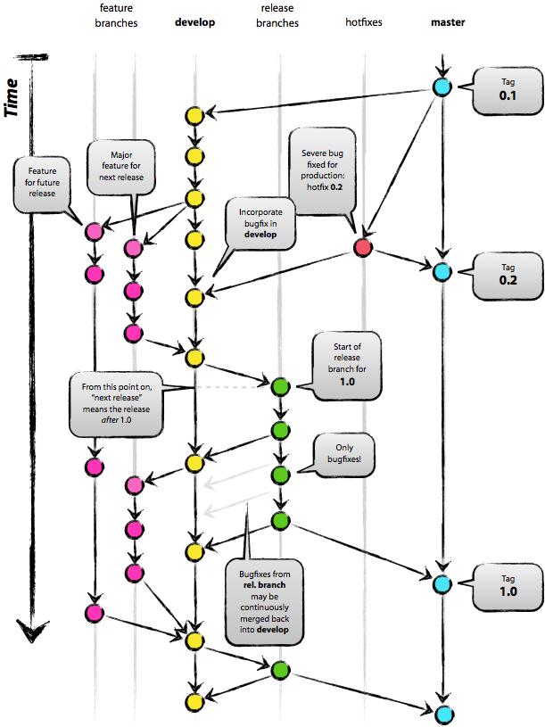

# 실무자가 알려주는 Git - 입문편
## 기초

### Git
#### What is Git?
- Git is a `free` and `open source` `distributed version control system` designed to `handle everything` from small to very large projects with `speed` and `efficiency`. ([Git 공식사이트](https://git-scm.com/))
- CVS, SVN, Mercurial 등이 있음
#### Why Git?
- 공유 (협업)
  - 대학교 때 USB로 코드 공유한 경험 있음
  - 실무에서 일할 때 하나의 프로젝트 내에서 부분을 나눠서 개발하게 됨. 작업이 끝난 코드를 적용해야 개발서버와 리얼서버에 반영할 수 있음
  - 내가 작업한 코드를 공용 저장소에 합치기 전에 코드 리뷰를 받을 수 있음
- 보관 (백업)
  - 안전하게 웹저장소에 코드를 저장해 놓음
  - 언제 어디서든 코드를 내려 받을 수 있음
  - GitHub이 망하지 않는 이상 내 코드는 안전
- 대세
  - 수많은 IT 기업들에서 사실상 표준으로 Git을 사용함. 엔터프라이즈 GitHub(또는 GitLab 등)도 사용하여서 코드를 관리하고 있음
  - 코드를 아무리 잘 짜도 코드를 공유하는데 어려움을 겪으면 실무에서 일하기 힘듦
- 기타
  - 개발자 뿐만 아니라 디자이너나 기획 직군도 사용하면 유용 (최종, 진짜 최종, 최종_final ...)

### Setting
#### 계정 연결 ([1.6 시작하기 - Git 최초 설정](https://git-scm.com/book/ko/v2/%EC%8B%9C%EC%9E%91%ED%95%98%EA%B8%B0-Git-%EC%B5%9C%EC%B4%88-%EC%84%A4%EC%A0%95))
```bash
git config --global user.name "Country"
git config --global user.email "hnaras@naver.com"
```

#### alias
```bash
git config --global alias.co checkout
git config --global alias.br branch
git config --global alias.ci commit
git config --global alias.st status 
git config --global alias.lg "log --graph --abbrev-commit --decorate --format=format:'%C(bold blue)%h%C(reset) - %C(bold green)(%ar)%C(reset) %C(white)%s%C(reset) %C(dim white)- %an%C(reset)%C(bold yellow)%d%C(reset)' --all"
```
- alias 및 현재 Git 설정 상태 보기: `git config --list`
- 참고: [Git Alias](https://git-scm.com/book/ko/v2/Git%EC%9D%98-%EA%B8%B0%EC%B4%88-Git-Alias)

### GitHub에 코드 올리기
- GitHub?
  - 온라인 코드 저장소
  - 무료. 단 비공개 저장소의 경우 3명 이상이 사용할 경우 유료
  - 많은 오픈소스들이 GitHub을 사용
- [GitHub](https://github.com/) login
- repository 생성
- ```bash
  cd ~
  mkdir git-exer
  cd git-exer
  echo "Country와 함께하는 Git 교실" >> README.md
  git init
  git add README.md
  git commit -m "initial commit"
  git remote add origin https://github.com/HwangNara/git-exer.git
  git push -u origin master
  ``` 

### GitHub에서 코드 받기

#### clone  
- 원격 저장소에 있는 코드를 내려 받는 것
- 실무에서 일하면서 새로운 repository를 만들어서 올리는 것보다 이미 다른 사람이 만든 것을 clone 하는 경우가 더 많다.

#### 강사 repository clone 실습
- https://github.com/HwangNara/git-class
```bash
cd ~
git clone https://github.com/HwangNara/git-class
cd git-class
```

#### Vue repository 실습
- https://github.com/vuejs/vue
```bash
git clone https://github.com/vuejs/vue.git
cd vue
echo "Vue에 코드 기여" >> my.md
git add my.md
git ci -m 'Add my.md'
git push
???
```

---

## 기본
### Git Lifecyle
- 간단히 add & commit(ci)
  - add: 이 파일을 Git이 관리하게 하겠다 (or 수정 완료했다)
  - commit: 이 파일을 Git에 저장하겠다
- 
  - 출처: [2.2 Git의 기초 - 수정하고 저장소에 저장하기](https://git-scm.com/book/ko/v2/Git%EC%9D%98-%EA%B8%B0%EC%B4%88-%EC%88%98%EC%A0%95%ED%95%98%EA%B3%A0-%EC%A0%80%EC%9E%A5%EC%86%8C%EC%97%90-%EC%A0%80%EC%9E%A5%ED%95%98%EA%B8%B0)
- Untracked
  - Git과 아무 상관이 없는 상태
  - 따라서 Git이 대상 파일을 관리하지 못함
  - 최초 `add`를 해줘야 Git의 관리 대상이 됨
  - Git이 관리하는 파일을 삭제하면 Untracked가 됨
- Unmodified
  - 코드 저장이 완료된 상태
  - Staged 상태에서 `commit`을 하면 Unmodified가 됨
- Modified
  - Git으로 관리되고 있던 코드를 수정하여 변경이 일어난 상태
  - Unmofieid 상태인 파일을 수정하면 Modified가 됨
  - `commit` 할 수 없음. `commit` 하려면 Staged 상태가 되야함
- Staged
  - 이제 코드를 저장해도 좋다는(`commit`이 가능한) 상태
  - Untracked/Modified 상태인 파일을 `add` 하면 Staged가 됨


### status (st)
- 현재 git 상태를 보여줌.
- Untracked files : `Untracked` 상태인 파일들
  - ```bash
    cd ~/git-exer
    echo "status exer" >> st.md
    git st
    
    ---

    On branch master
    Untracked files:
    (use "git add <file>..." to include in what will be committed)

    st.md

    nothing added to commit but untracked files present (use "git add" to track)
    ```
- Changes to be committed: `Staged` 상태인 파일들
  - ```bash
    git add st.md
    git st

    ---

    On branch master
    Changes to be committed:
    (use "git reset HEAD <file>..." to unstage)

    new file:   st.md

    ```
- nothing to commit, working tree clean: `Unmodified` 상태인 파일들
  - ```bash
    git ci -m 'Make st.md'
    git st

    ---

    On branch master
    nothing to commit, working tree clean
    ```

### log (lg)
- 히스토리를 조회하는 명령어
- 커밋 단위로 히스토리가 쌓임
- log를 볼 줄 알아야 develop, release, hotfix 브랜치가 난무할 때 merge 방향이나 순서를 이해할 수 있음
- 위에 있는 것이 최신, 아래 있을 수록 예전 커밋
```bash
git lg

---

* ab118e1 - (73 minutes ago) Make st.md - Country
* e5d33ad - (2 days ago) initial commit - Country (origin/master)
```

### add
- 파일을 `Staged` 상태로 만듦 -> 파일을 Git이 관리하는 상태로 만듦
  - `Untracked` / `Modified` 상태의 파일에 사용할 수 있음
- 이제 `commit`을 하면 코드를 저장할 수 있음
- `Untracked` 에서 진행
  - ```bash
    echo "## Git class" >> index.md
    git st

    ---

    On branch master
    Untracked files:
    (use "git add <file>..." to include in what will be committed)

    index.md

    nothing added to commit but untracked files present (use "git add" to track)
    ```
    ```bash
    git add index.md
    git st

    ---

    On branch master
    Changes to be committed:
    (use "git reset HEAD <file>..." to unstage)

    new file:   index.md
    ```
- `Modified` 에서 진행
  - ```bash
    vi st.md
    git st

    ---

    Changes not staged for commit:
    (use "git add <file>..." to update what will be committed)
    (use "git checkout -- <file>..." to discard changes in working directory)

    modified:   st.md
    ```
    ```bash
    git add st.md
    git st

    ---

    On branch master
    Changes to be committed:
    (use "git reset HEAD <file>..." to unstage)

    new file:   index.md
    modified:   st.md
    ```

### commit (ci)
- 파일을 `Unmodified` 상태로 만듦 -> 한 단위의 작업이 완료
- Git 시스템에 영구적으로 변경을 저장
- SHA-1 알고리즘을 적용한 해시값을 키로 생성.
- 히스토리가 하나 추가됨
- 실무에서 한 작업 (기능, 피처) 단위로 한 커밋 권장
- ```bash
  git ci -m 'Modify files'

  ---

  [master 42298d3] Modify files
  2 files changed, 2 insertions(+)
  create mode 100644 index.md
  ```
-  ```bash
   git st

   ---

   On branch master
   nothing to commit, working tree clean
   ```
-  ```bash
   git lg

   ---

   * 1e928bc - (20 seconds ago) Modify files - Country (HEAD -> master)
   * 51462d0 - (4 hours ago) Modify st.md - Country
   * ab118e1 - (4 hours ago) Make st.md - Country
   * e5d33ad - (2 days ago) initial commit - Country (origin/master)   ```
#### 옵션
- `-m` : 메시지를 넣음
- `-a` : `add`를 같이 함. 단순히 Modified
- `-am` : `-a`와 `-m`을 합친 것. 제일 많이 사용
- `--amend`
  - 마지막 커밋을 수정
  - `Stage` 상태의 파일들과 같이 커밋됨
  - 만약 `Stage`에 아무것도 없다면 (`commit`이후에 작업을 안했으면) 커밋 메시지만 수정
  - ```bash
    git lg

    ---

    * 1e928bc - (5 minutes ago) Modify files - Country (HEAD -> master)
    * 51462d0 - (4 hours ago) Modify st.md - Country
    * ab118e1 - (4 hours ago) Make st.md - Country
    * e5d33ad - (2 days ago) initial commit - Country (origin/master)
    ```
  - ```bash  
    git ci --amend

    ---

    [master 69e0e26] Rewrite commit message
    Date: Mon Mar 9 23:32:31 2020 +0900
    2 files changed, 2 insertions(+)
    create mode 100644 index.md
    ```
  - ```bash
    git lg

    ---

    * b0c729f - (6 minutes ago) Rewrite commit message - Country (HEAD -> master)
    * 51462d0 - (4 hours ago) Modify st.md - Country
    * ab118e1 - (4 hours ago) Make st.md - Country
    * e5d33ad - (2 days ago) initial commit - Country (origin/master)
    ```

### branch (br)
- 커밋 사이를 가볍게 이동할 수 있는 어떤 포인터 같은 것 ([3.1 Git 브랜치 - 브랜치란 무엇인가
](https://git-scm.com/book/ko/v2/Git-%EB%B8%8C%EB%9E%9C%EC%B9%98-%EB%B8%8C%EB%9E%9C%EC%B9%98%EB%9E%80-%EB%AC%B4%EC%97%87%EC%9D%B8%EA%B0%80))
- 하나의 작업 공간 단위 정도로 생각
- 브랜치 확인: `git br`
- 브랜치 생성: `git br test/1`
- 브랜치 삭제: `git br -D test/1`

### branch 전략
#### Git branch 전략 (Git Flow)
- 
- master
  - git init하면 생기는 태초의 브랜치
  - 배포 가능한, 말그대로 master 브랜치
  - 보통 태그를 따서 태그로 배포함
- develop
  - 보통 작업할 때 기준이 되는 브랜치. 
  - 개발 서버에도 평소에는 develop 기준으로 배포하며 테스트 함
  - 생성 위치: `master` (태초)
- hotfix
  - 서비스에 문제가 생기거나 갑자기 무언가 고쳐서 배포해야 할 때 사용
  - 생성 위치: `master` (그렇지 않으면 다른 작업들이 딸려 나감)
  - merge: `master` & `develop`
- feature
  - 실제로 뭔가 기능(feature)를 만드는 브랜치
  - 생성 위치: `develop`
  - merge: `develop` (code reivew)
- release
  - 새로운 기능들을 추가하여 배포하기 위한 브랜치
  - 생성 위치: `develop`
  - merge: `master` & `develop`
- 다른 Git branch 전략들도 있음
  - GitHub Flow, Release Flow ...
  - 참고: https://newsignature.com/articles/git-branching-strategies-which-one-should-i-pick/

#### HEAD
- 지금 작업하는 로컬 브랜치를 가리키는 포인터 ([3.1 Git 브랜치 - 브랜치란 무엇인가](https://git-scm.com/book/ko/v2/Git-%EB%B8%8C%EB%9E%9C%EC%B9%98-%EB%B8%8C%EB%9E%9C%EC%B9%98%EB%9E%80-%EB%AC%B4%EC%97%87%EC%9D%B8%EA%B0%80))
- *현재 브랜치 마지막 커밋의 스냅샷*
- branch를 변경하면 해당 브랜치의 마지막을 가리키고 있음
- HEAD를 움직이면서 여러 버전의 코드들을 볼 수 있음

### checkout (co)
- 다른 브랜치로 이동
- 옵션
  - `-b` : 브랜치 생성하고 그 브랜치로 checkout
    - 아래 두 명령은 같음
    - ```bash
      git co -b develop
      ```
    - ```bash
      git br develop
      git co develop
      ```
- ```bash
  git co master
  ```

### checkout TIP
- 커밋의 hash값을 알면 시간 여행이 가능함
- ```bash
  git lg
  
  ---

  * b0c729f - (3 hours ago) Rewrite commit message - Country (HEAD -> master)
  * 51462d0 - (6 hours ago) Modify st.md - Country
  * ab118e1 - (7 hours ago) Make st.md - Country
  * e5d33ad - (2 days ago) initial commit - Country (origin/master)
  ```
- ```bash
  git co e5d33ad

  ---

  Note: checking out 'e5d33ad'.

  You are in 'detached HEAD' state. You can look around, make experimental
  changes and commit them, and you can discard any commits you make in this
  state without impacting any branches by performing another checkout.

  If you want to create a new branch to retain commits you create, you may
  do so (now or later) by using -b with the checkout command again. Example:

  git checkout -b <new-branch-name>

  HEAD is now at e5d33ad initial commit
  ```
- ```bash
  git lg

  ---

  * b0c729f - (3 hours ago) Rewrite commit message - Country (master)
  * 51462d0 - (6 hours ago) Modify st.md - Country
  * ab118e1 - (7 hours ago) Make st.md - Country
  * e5d33ad - (2 days ago) initial commit - Country (HEAD, origin/master)
  ```

### push
- 로컬 브랜치의 정보를 원격 저장소로 업로드
- Clone 한 리모트 저장소에 쓰기 권한이 있어야 함
- 같은 브랜치로 여러명이 받아서 누군가 push를 했다면 나는 push 안됨
- 다른 사람이 작업한 것을 가져와서 합친 후에 (Merge or Rebase) Push 할 수 있음
- ```bash
  git co master
  git push [origin] [master]
  ```
- 옵션
  - `--force` (`-f`)
    - 내 로컬 브랜치로 원격 브랜치를 덮어 씌워버림
    - 내가 혼자 작업하던 feature 브랜치에서만 사용해야함
    - 시나리오: 누군가 악의적으로 master브랜치를 망가뜨린다면?

### pull, fetch
- *Clone 한 서버에서 데이터를 가져오고, 그 데이터를 자동으로 현재 작업하는 코드와 Merge* ([2.5 Git의 기초 - 리모트 저장소
](https://git-scm.com/book/ko/v2/Git%EC%9D%98-%EA%B8%B0%EC%B4%88-%EB%A6%AC%EB%AA%A8%ED%8A%B8-%EC%A0%80%EC%9E%A5%EC%86%8C))
- `fetch`: 서버에서 데이터만 가져오고 자동으로 코드를 합치지는 않음
- ```bash
  -- 새로운 디렉토리
  cd ~
  mkdir git-other
  cd git-other
  git clone 'https://github.com/HwangNara/git-exer.git'
  cd git-class
  vi README.md
  git ci -am 'Modify README.md'
  git push
  ```
- ```bash
  -- 원래 디렉토리
  git pull
  ```

### pull & push 실습
- 환경: master에서 딴 test 브랜치 / 2개의 터미널
- 내용
  1. fetch vs. pull
  2. pull 충돌 실험
  3. branch 삭제
- 추가 명령어
  - 파일 변경 내용 보기: `git diff`
  - 리모트의 브랜치 삭제: `git push origin --delete {branch명}`
  - 삭제된 리모트 브랜치를 로컬에도 반영: `git fetch -p`
---

## 협업

### stash
- 작업 하던 내용을 임시 저장
- 브랜치에서 작업하다가 다른 브랜치로 변경해야 하는데 커밋은 하고 싶지 않은 경우
- stack처럼 작동
- `stash`, `pop`을 많이 사용
- 실습
  - ```bash
    vi README.md
    git stash
    git st
    git stash list
    git stash pop
    git st
    ```
- `apply`, `drop` 등의 옵션이 있음

### merge
- 협업의 핵심. 다른 브랜치와 현재 브랜치를 합쳐서 코드를 합침
- 방식
  - fast-forward
    - 커밋들이 공통이고 대상 브랜치의 커밋만 증가 했을 경우 단순히 HEAD만 옮겨짐
  - 3-way Merge 
    - 두 갈래로 나온 변경들을 합쳐서 새로운 커밋을 만듦
    - conflict
  - squash
    - 대상 브랜치의 커밋들을 하나의 커밋으로 합쳐서 merge
    - `git merge --squash master`
- 실습
  - 상황: 다른 사람이 master에서 같은 파일을 고침

### rebase
#### 1. 다른 브랜치와 병합 ([3.6 Git 브랜치 - Rebase 하기](https://git-scm.com/book/ko/v2/Git-%EB%B8%8C%EB%9E%9C%EC%B9%98-Rebase-%ED%95%98%EA%B8%B0))
- 기능은 `merge`와 같음 (코드를 합침)
- 내 브랜치의 커밋을 대상 브랜치의 위(다음)으로 생성함
- 깔끔한 로그를 유지할 수 있음
- 실습
  - 상황: master의 변경들을 feature/c에서 rebase 해본다
    - 대상 브랜치의 커밋만 진행 (fast-forward)
    - 두 브랜치 모두 커밋이 있지만 충돌이 나지 않음 (auto merging)
    - 두 브랜치 모두 커밋이 있고 충돌이 남 (conflict)


#### 2. 커밋 여러개 수정하기
- 주의
  - `push`해서 누군가 사용하고 있는 커밋을 `rebase` 하면 안됨 (헬게이트가 열림)
  - 해당 커밋을 기반으로 작업을 했을 텐데 그 기반을 바꿔 버리는 것
  - `push`를 했더라도 아직 merge되지 않았고 다른 사람이 사용하지 않는 브랜치라면 (보통 feature 브랜치) 마음대로 `rebase`를 해도 무방
- `-i`: 대화형 모드
- 가장 위에 있는 커밋이 오래된 것 (`git st`와 반대)
- 옵션
  - `--abort` : rebase를 중단. 원래 상태로 돌아감
  - `--continue` : rebase를 계속 진행. 다음 단계로 넘어감
  - `--skip` : 대상 브랜치의 내용으로 적용
- 커밋 목록에서의 옵션
  - `p`, pick = use commit
  - `r`, reword = use commit, but edit the commit message
  - `e`, edit = use commit, but stop for amending
  - `s`, squash = use commit, but meld into previous commit
  - `f`, fixup = like "squash", but discard this commit's log message
  - `x`, exec = run command (the rest of the line) using shell
- 실습
  - 상황: 커밋 하나를 한 뒤, 오타가 있어서 추가 커밋을 함. 그리고 추가 작업까지 한 상태

### pull request 실습
- 상황1: conflict 발생하지 않음
  - feature/d 브랜치에서 commit & push
- 상황2: conflict 발생 > 로컬에서 해결하고 다시 push
  - master 브랜치에서 README 파일 변경 commit & push
  - feature/e 브랜치에서 README 파일 변경 commit & push


### reset
- 상태를 이전 커밋으로 reset 시킴
- 옵션에 따라서 몇 커밋 이전 / 어느 단계(`Staged`, `Modified`, `Unmodified`)까지 reset 할지를 결정
- `show`: 커밋 정보를 보여줌
  - HEAD == @, ~ == ^
  - ex) HEAD~, HEAD^, @~, @^ : 한 커밋 이전
  - @~2: 2커밋 이전
- 옵션
  - `--soft`
    - `commit` 명령만 되돌림 (`Staged` 상태가 됨)
    - HEAD만 해당 커밋으로 돌림
    - ```bash
      vi README.md
      git ci -am 'Commit for reset exer'
      git reset --soft @^
      git st

      ---

      On branch develop
      Changes to be committed:
      (use "git reset HEAD <file>..." to unstage)

      modified:   README.md
      ```
  - `--mixed` (기본)
    - `commit` 명령도 되돌리고, `add` 명령까지 되돌림 (`Modified` 상태가 됨)
    - ```bash
      git ci -am 'Commit for reset exer'
      git reset --mixed @~1
      git st

      ---

      On branch develop
      Changes not staged for commit:
        (use "git add <file>..." to update what will be committed)
        (use "git checkout -- <file>..." to discard changes in working directory)

        modified:   README.md      
      ```
  - `--hard`
    - `commit` 명령도 되돌리고, `add` 명령도 되돌리고, 워킹 디렉토리까지 되돌림 (`Unmodified` 상태가 됨)
    - 워킹 디렉토리까지 되돌려 버리기 때문에 복구가 불가능!
    - ```bash
      git ci -am 'Commit for reset exer'
      git reset --hard @^
      git st

      ---

      On branch develop
      nothing to commit, working tree clean
      ```

### cherry-pick
- 다른 커밋을 가져옴
- 커밋의 수가 적다면 merge나 rebase보다 간결하고 깔끔한 트리를 유지할 수 있음
```bash
git co master
git co -b feature/f
vi README.md
git ci -am 'Cherry-pick test'

git co master
git cherry-pick {{hash}}

```

### tag
- 릴리즈를 하기 위한 브랜치 같은 것
- GitHub에서 Release를 만들면서 하면 편함
```bash
-- 이때까지 작업한 것을 push
git push
```
- GitHub 실습
  - releases 클릭
  - create a new release
    - 태그 이름: v1.0.0
    - 기준 브랜치: master
    - title과 content 작성
